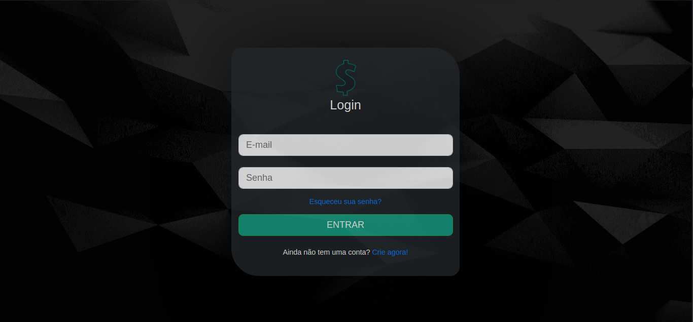
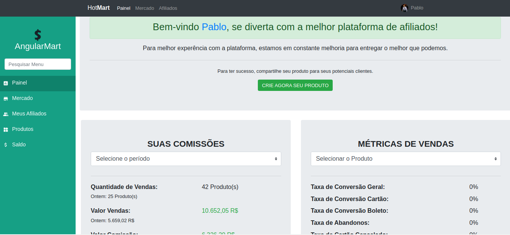
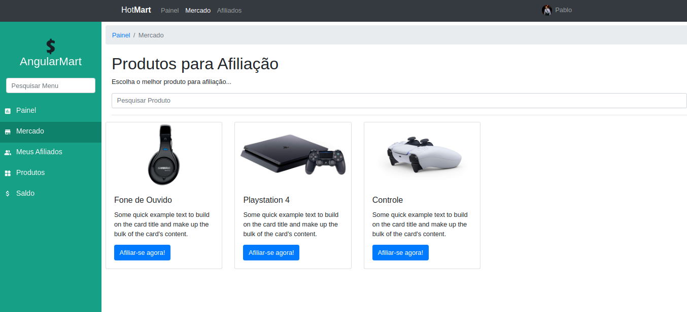

# AngularMart

Plataforma similar ao Hotmart, o qual o vendedor anuncia um produto e o afiliado realiza a divulgação/venda do produto e adquire comissão.

## Tecnologias

* Angular 10.
* Angular Material.
* Angular Forms.
* Angular Routing.
* Angular RxJs.

## Imagens

- ## Página de Login

- ## Página Principal

- ## Página da Loja

## Executando o Servidor

Digite `ng serve`. Navegue até `http://localhost:4200/`.
